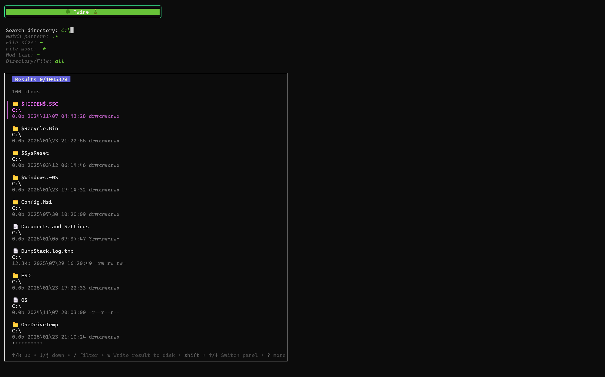

# 🌳 Twine 🎄

Twine is a command-line utility built on Go’s concurrency model designed for rapid and efficient file system exploration. It provides a powerful solution for
locating files based on a variety of criteria, significantly reducing search times compared to traditional file search methods. Twine is particularly well-suited
for forensic analysis, data recovery, and system administrators requiring precise and timely file identification.

## Key Capabilities 

*   **Concurrent File System Exploration:** Leveraging Go’s concurrency, Twine simultaneously traverses the file system, minimizing search latency.
*   **Optimized Performance:** Designed for speed and efficiency, offering significant performance improvements over standard file search utilities.
*   **Granular Filtering:**  Precise search capabilities through configurable filters:
    *   **Name Matching:**  Supports wildcard patterns for flexible filename searches.
    *   **Date-Based Filtering:**  Search based on file modification and access times with defined date ranges.
    *   **Size-Based Filtering:**  Identify files exceeding or falling within specified size ranges.
    *   **File Type Filtering:**  Target specific file extensions.
    *   **Directory/File Scope:**  Specify whether to search within directories or files independently.
*   **Command-Line Interface:** A robust, command-line interface allows for scripting and automation within a professional environment.

## Features

*   **Fast File Searching:** Leverages Go’s concurrency and efficient file system traversal for rapid searches.
*   **Granular Control:**  Refine searches using filters like file name, modification date, and file type.
*   **Terminal UI:**  Provides a focused, command-line interface for efficient investigation.

## Getting Started

1.  **Clone the Repository:**

    ```bash
    git clone https://github.com/your-username/twine.git
    cd twine
    ```

2.  **Build the Project:**

    ```bash
    go build
    ```

3.  **Run the Application:**

    ```bash
    ./twine 
    ```

## Usage



**Filtering fields**

`Tab/shift+Tab` to go up or down an filter field.

*   `Search directory`:  The directory to search.  If not provided, defaults to the current directory.
*   `Match pattern`:  Regex match against the file name or file path (i got lazy, this was supposed to be separate).
*   `Size match`:  Filter by file size `0b`**-**`<leave empty for unbounded>`.

    Supports floating point file sizes in larger units e.g `2.3mb`, `300kib`, `1gb`. Largest unit is `gb`/`gib`. 

*   `Mod time`:  Search for files modified after the given date `1970\\01\\12 00:00:00`**-**`today`.

    Specific time is optional but date must be provided. Date range can also be left unbounded.

*   `Directory/File`:  Filter by file or directory.

## License

The MIT License. See the [LICENSE](LICENSE) file for details.